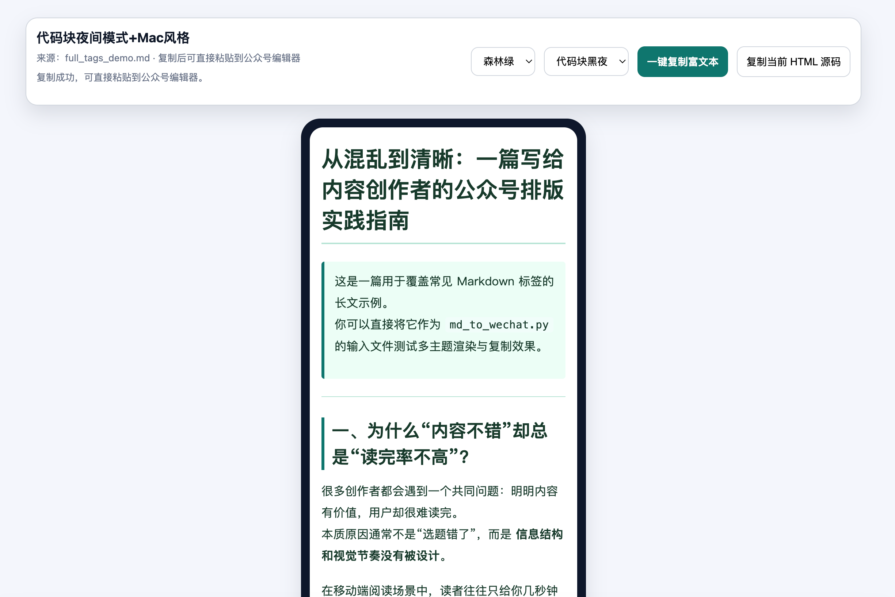
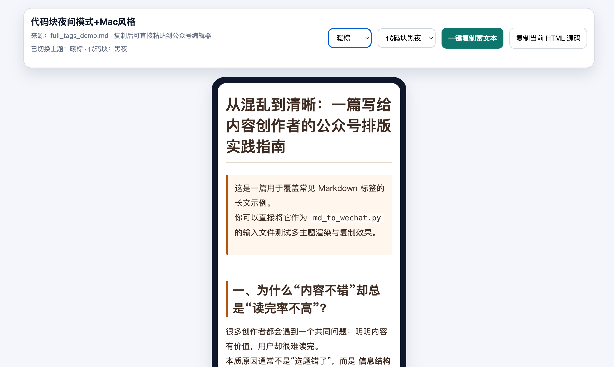
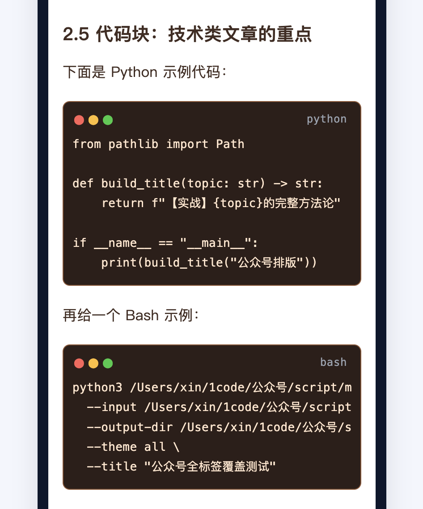

# easy-md2mp：Markdown 转微信公众号排版 Skill（支持多主题、预览、一键复制）

`easy-md2mp` 是一个面向智能体（AI Agent）的开源 Skill，用于把 `Markdown` 一键转换为**微信公众号可粘贴排版 HTML**，并生成可视化预览页。  
适合“公众号文章排版”“md 转公众号”“公众号一键复制排版”“微信图文 Markdown 转换”等场景。

> 关键词：Markdown 转微信公众号、公众号排版工具、微信图文 HTML、公众号代码块样式、AI Agent Skill、md2mp

---

## 功能特性

- Markdown 转微信公众号友好 HTML（内联样式）
- 多主题排版（`minimal` / `tech-blue` / `warm` / `forest`）
- 代码块亮色/黑夜模式（`normal` / `night`）
- Mac 风格代码头（红黄绿圆点 + 语言标签）
- 预览页主题切换 + 代码模式切换
- 预览页一键复制富文本，便于粘贴到公众号编辑器
- 内置自测样例，安装后可快速验证

---

## 效果预览（占位，待你上传图片）

> 你上传截图后，把下面路径替换成真实图片文件即可。





---

## 目录结构

```text
easy-md2mp/
├── SKILL.md
├── README.md
├── assets/
│   └── example.md
├── scripts/
│   ├── md_to_wechat.py
│   ├── themes.json
│   └── requirements.txt
└── references/
    └── troubleshooting.md
```

---

## 快速开始

### 1) 安装依赖

```bash
python3 -m pip install -r ./scripts/requirements.txt
```

### 2) 使用示例 Markdown 进行自测

```bash
python3 ./scripts/md_to_wechat.py \
  --input ./assets/example.md \
  --output-dir ./out \
  --theme all \
  --code-mode night \
  --mac-style \
  --title "easy-md2mp 自测"
```

### 3) 打开预览页

执行完成后，打开：

```text
./out/example.preview.html
```

在页面中切换主题和代码模式，然后点击“一键复制富文本”，粘贴到微信公众号编辑器。

---

## 命令参数说明

```bash
python3 ./scripts/md_to_wechat.py \
  --input <markdown_path> \
  --output-dir <output_dir> \
  --theme all|minimal|tech-blue|warm|forest \
  --code-mode normal|night \
  --mac-style|--no-mac-style \
  --title "<文章标题>"
```

- `--theme`：主题选择，默认建议 `all`
- `--code-mode`：代码块模式（亮色/黑夜）
- `--mac-style`：是否显示 Mac 风格代码头（默认开启）

---

## 输出文件说明

假设输入是 `article.md`，会生成：

- `article.minimal.wechat.html`
- `article.tech-blue.wechat.html`
- `article.warm.wechat.html`
- `article.forest.wechat.html`
- `article.preview.html`（预览页，支持切换与复制）
- `article.manifest.json`（输出清单）

---

## 公众号兼容说明

- 代码头圆点与语言标签使用真实节点，降低粘贴丢失风险
- 代码区横向滚动时，头部信息保持稳定
- 本地图片路径在公众号通常不可直接显示，建议替换为公网 URL
- 若样式偶发丢失，优先使用 Chrome 从预览页复制内容区域

---

## 常见问题（FAQ）

### Q1：为什么粘贴到公众号后图片不显示？
通常是本地路径导致。公众号编辑器不直接读取本地文件，需上传图床/微信接口后替换图片 URL。

### Q2：为什么代码块样式和预览页不一致？
请确认使用最新生成的 `*.preview.html` 进行复制，避免复制旧文件内容。

### Q3：这个项目适合谁？
适合公众号创作者、技术写作者、内容运营，以及需要把 Markdown 快速转微信公众号排版的团队。

---

## SEO 关键词建议（可用于仓库 Topics）

- wechat
- wechat-official-account
- markdown
- markdown-to-html
- wechat-article
- content-creation
- ai-agent-skill
- md2mp

---

## 开源协议

建议使用 MIT 协议（可新增 `LICENSE` 文件）。

---

## 致谢

感谢所有反馈“公众号粘贴兼容性”问题的用户，你们的场景推动了这个 Skill 的持续改进。

